<div align="center">

# LiveKeys

**Votre clavier. Toutes vos scènes.**

Application iPad pour les claviéristes en live : layers, splits, setlists et plugins AUv3 dans un seul setup de scène.

[Site du projet](https://livekeys.quentinlogie.fr) · [Signaler un problème](https://github.com/aspitrine/livekeys/issues)


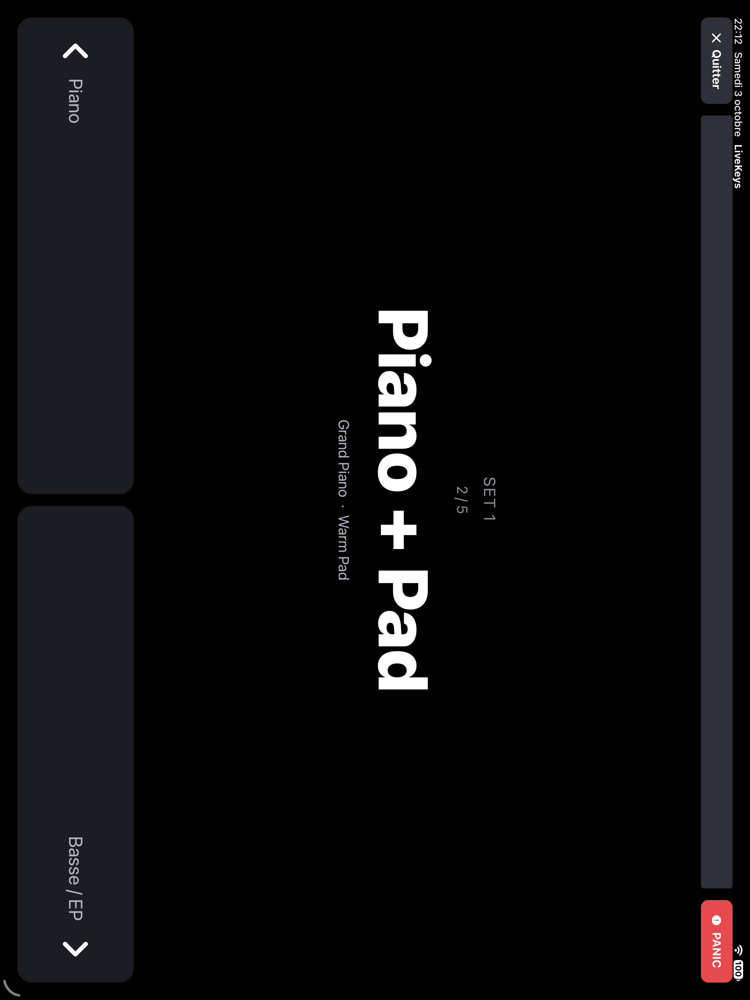

</div>

---

## Sommaire

- [Présentation](#présentation)
- [Fonctionnalités](#fonctionnalités)
- [Captures](#captures)
- [Architecture](#architecture)
  - [Vue d’ensemble](#vue-densemble) · [Modèle de données](#modèle-de-données) · [Routage MIDI](#routage-dune-note-midi-vers-les-layers) · [Graphe audio](#graphe-audio) · [Changement de patch](#changement-de-patch-et-préchargement) · [Pad d’accords](#pad-daccords)
- [Démarrage](#démarrage)
- [Qualité et tests](#qualité-et-tests)
- [Site de présentation](#site-de-présentation)
- [Crédits des sons](#crédits-des-sons)
- [Licence](#licence)

## Présentation

LiveKeys transforme un iPad en hôte de clavier pour la scène. Chaque morceau devient un **patch** qui combine plusieurs
instruments, répartis ou superposés sur le clavier, avec leurs effets. Les patches s’organisent en **setlists** et
s’enchaînent pendant le concert depuis un clavier MIDI, sans toucher l’écran.

L’application cible iPadOS (et Mac via « Designed for iPad »). Elle est en développement et n’est pas encore publiée
sur l’App Store.

## Fonctionnalités

| Domaine              | Ce que fait LiveKeys                                                                                             |
| -------------------- | ---------------------------------------------------------------------------------------------------------------- |
| **Layers et splits** | Plusieurs instruments par patch, avec volume, panoramique et effets par layer.                                   |
| **Zones de clavier** | Plages de notes et de vélocité, transposition et canal MIDI pour chaque son.                                     |
| **Pad d’accords**    | Une nappe qui suit les accords joués ou tient un accord fixe, avec registre et fondu entre les harmonies.        |
| **Setlists**         | Préparation du concert, notes de scène et préchargement des patches voisins pour des transitions sans attente.   |
| **AUv3**             | Instruments et effets Audio Unit v3 tiers avec leur interface, tempo du patch transmis aux plugins synchronisés. |
| **MIDI**             | Claviers USB et Bluetooth, MIDI Learn (volumes avec rattrapage, mute des layers, patches, pads, Tap Tempo).      |
| **Sons intégrés**    | Piano droit et banque GeneralUser GS inclus, pianos et Rhodes supplémentaires téléchargeables.                   |
| **Sécurité scène**   | Vérification du concert, limiteur sur le bus master, suivi de la charge DSP et bouton Panic.                     |

## Captures

| Layers                                                                     | Split                                                                    | Effets                                                                      |
| -------------------------------------------------------------------------- | ------------------------------------------------------------------------ | --------------------------------------------------------------------------- |
| 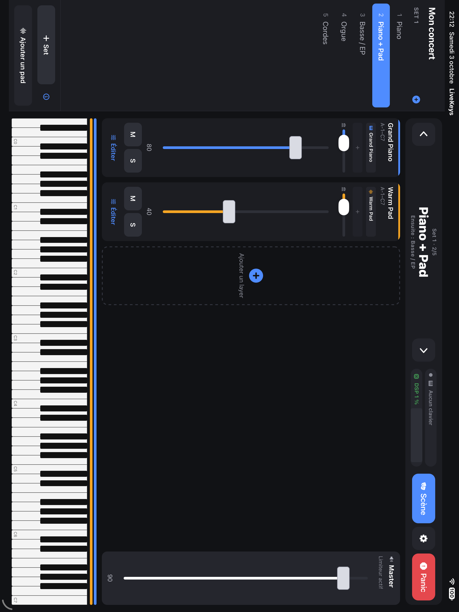 | 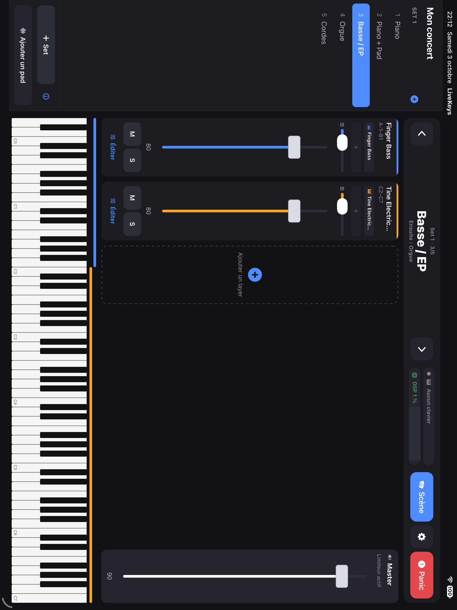 | 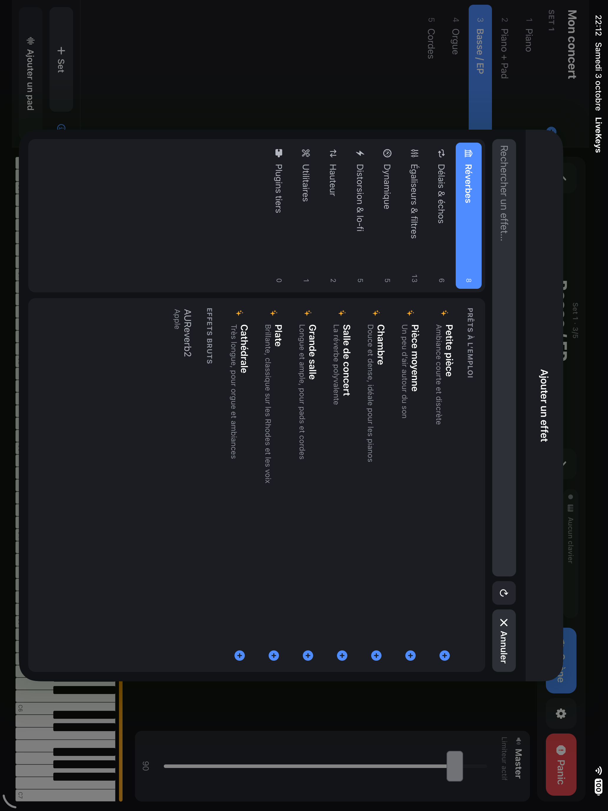 |

## Architecture

LiveKeys sépare l’interface (TypeScript) du moteur audio temps réel (natif).

### Vue d’ensemble

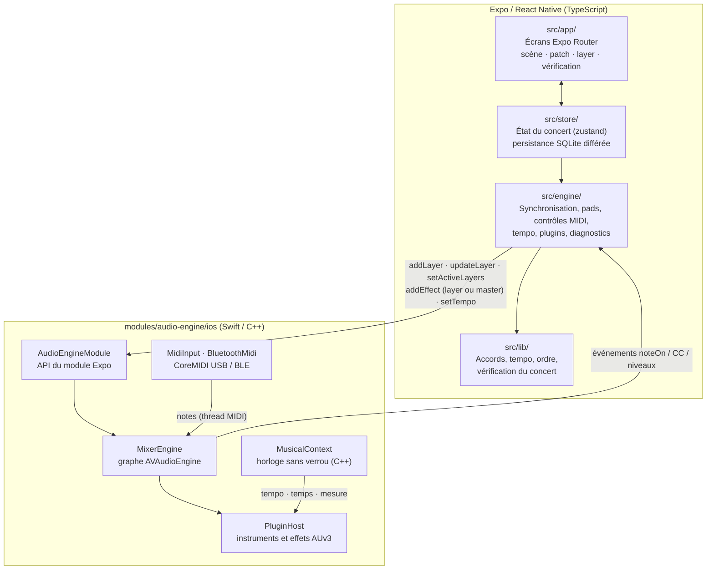

L’état du concert vit côté JavaScript ; le moteur natif ne reçoit que des configurations à appliquer. Les notes MIDI,
elles, sont routées directement en natif : l’interface n’est jamais sur le chemin critique du son.

### Modèle de données

Un concert regroupe des setlists, chaque setlist des patches, et chaque patch des **layers**. Un layer est un
instrument (SoundFont ou AUv3) avec sa zone de clavier, sa chaîne d’effets et, optionnellement, un pad d’accords.

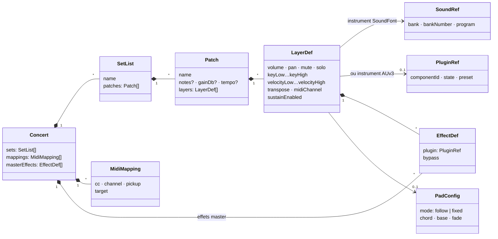

Les `MidiMapping` relient un contrôleur physique à une cible : volume master, volume ou on/off du N-ième layer du
patch courant, patch suivant/précédent, pad, Tap Tempo ou Panic. Le pad d’accords n’a pas de position : « layer N »
compte uniquement les layers de la table de mixage, dans l’ordre choisi par glisser-déposer.

### Routage d’une note MIDI vers les layers

Chaque note entrante est évaluée sur le thread MIDI, sous un verrou court, contre tous les layers du patch actif.
Une même note peut déclencher plusieurs layers (superposition) ou un seul selon sa zone (split).

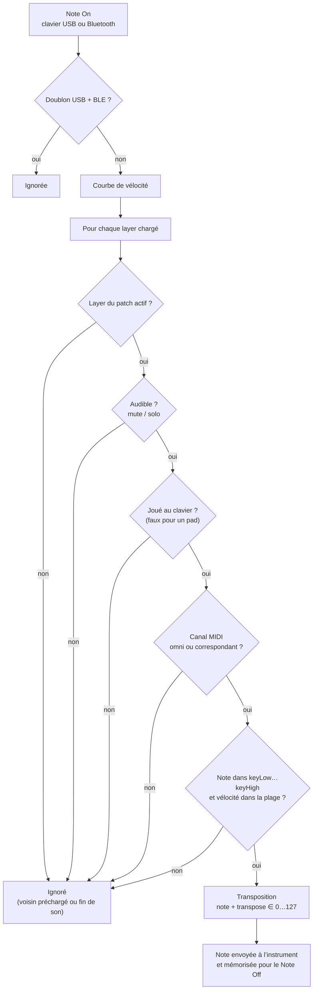

### Contrôles MIDI (CC)

Les faders, boutons et pédales passent par le MIDI Learn. Les CC réservés au mixer (volumes, on/off des layers) sont
retenus en natif pour ne pas modifier en même temps l’expression ou le volume des instruments.

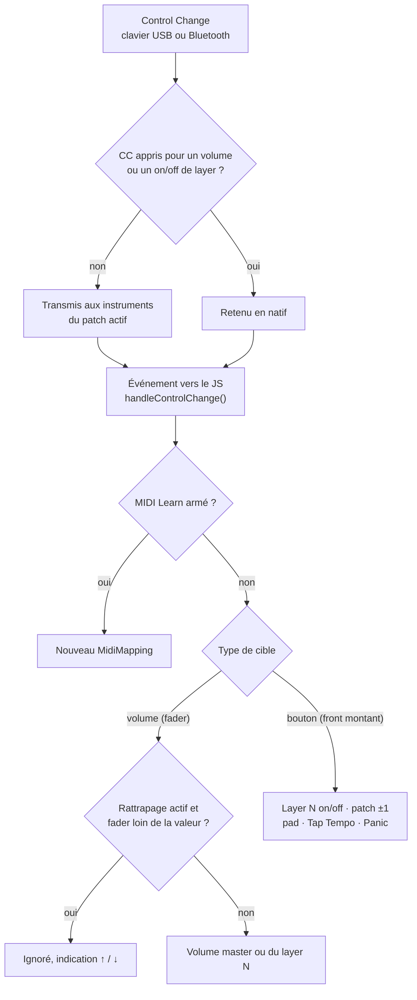

Le rattrapage se réarme à chaque changement de patch : un fader resté en bas ne coupe pas le patch suivant.

### Graphe audio

Chaque layer possède sa propre chaîne. Le niveau du patch (−24…0 dB) s’applique sur chaque strip sans changer
l’équilibre entre layers. Toutes les chaînes convergent vers un bus master protégé, dont les effets en insert
(réverbe commune, égaliseur…) sont partagés par tous les patches du concert. Les AUv3 reçoivent le tempo du patch par
le contexte musical de l’hôte.

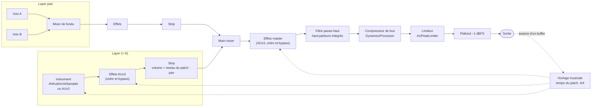

Le callback audio ne prend aucun verrou et n’alloue rien : les mesures DSP passent par des compteurs atomiques lus
depuis un autre thread.

### Changement de patch et préchargement

`syncPatches` sérialise les demandes et ignore celles devenues obsolètes. Le patch actif est chargé en premier, ses
voisins dans la setlist ensuite, pour que le passage au patch suivant soit instantané.

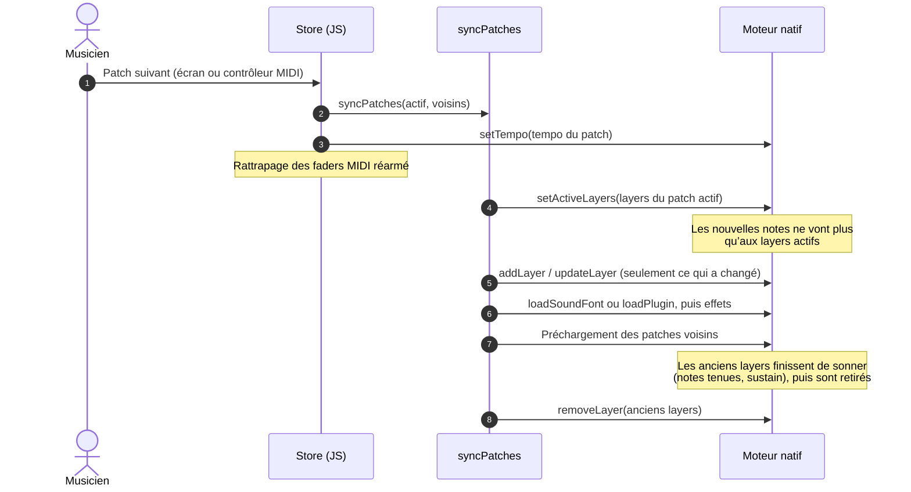

Les réglages de mix (fader, mute, solo) contournent cette file : un chargement lent de banque ne retarde jamais une
action sur scène.

### Pad d’accords

Un layer pad n’écoute pas le clavier directement. Le JavaScript détecte l’accord joué, calcule un voicing dans le
registre choisi, puis le moteur fait un fondu entre deux voix pour passer d’une harmonie à l’autre sans coupure.

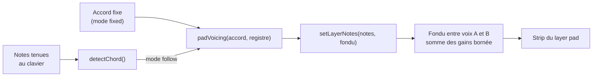

### Stack technique

| Couche    | Technologies                                                        |
| --------- | ------------------------------------------------------------------- |
| Interface | Expo SDK 57, React Native 0.86, React 19, Expo Router, TypeScript   |
| Audio     | Swift, C++, AVAudioEngine, AVAudioUnitSampler, Audio Unit v3        |
| MIDI      | CoreMIDI, Bluetooth LE MIDI                                         |
| Outillage | Oxlint, Oxfmt, Jest, React Native Testing Library, SwiftPM, Maestro |
| Build     | EAS Build (Continuous Native Generation)                            |

## Démarrage

### Prérequis

- macOS avec Xcode et un simulateur iPad (ou un iPad en développement)
- Node.js 24 LTS et npm

### Installation

```bash
npm ci
npx expo run:ios
```

Le moteur audio étant un module natif, l’application nécessite un **development build** : Expo Go ne suffit pas.
Les dossiers natifs sont générés depuis `app.json` (CNG) et ne se modifient pas à la main.

### Commandes utiles

| Commande              | Rôle                                                              |
| --------------------- | ----------------------------------------------------------------- |
| `npm start`           | Serveur de développement Expo                                     |
| `npm run format`      | Formatage avec Oxfmt                                              |
| `npm run lint`        | Analyse statique avec Oxlint                                      |
| `npm run typecheck`   | Vérification TypeScript, tests inclus                             |
| `npm run check`       | Formatage, lint, types, tests unitaires/intégration et couverture |
| `npm run test:native` | Tests Swift/C++ avec vrais samplers Apple et Thread Sanitizer     |
| `npm run check:all`   | Tout `check`, plus tests natifs et parcours E2E iOS               |

## Qualité et tests

Le projet combine plusieurs niveaux de tests, chacun avec un périmètre explicite :

- **Unitaires** (`tests/unit/`) : détection et voicing d’accords, édition du concert, persistance.
- **Intégration** (`tests/integration/`) : store réel, logique pads/MIDI et synchronisation avec le moteur ; seuls
  l’audio natif et SQLite sont substitués.
- **Natifs** (`tests/native/`) : rendu PCM hors ligne avec de vrais samplers Apple, règles de gain et de Panic,
  lectures concurrentes des compteurs DSP, le tout sous Thread Sanitizer.
- **E2E** (`.maestro/flows/`) : navigation, mode scène, pad et Panic sur simulateur iPad.

Des seuils de couverture s’appliquent aux modules critiques. Les tests JavaScript ne valident ni le son réel ni la
connectivité MIDI : ces changements demandent aussi un build natif et un essai sur iPad.

Détails dans [`docs/TESTING.md`](docs/TESTING.md) et [`docs/AUDIO_DIAGNOSTICS.md`](docs/AUDIO_DIAGNOSTICS.md).

## Site de présentation

Le dossier [`website/`](website/) contient le site [livekeys.quentinlogie.fr](https://livekeys.quentinlogie.fr),
un projet Nuxt 4 statique indépendant de l’application, conteneurisé avec nginx et déployé sur Coolify à chaque push
sur `main`.

## Crédits des sons

| Banque           | Auteur               | Licence                     |
| ---------------- | -------------------- | --------------------------- |
| GeneralUser GS   | S. Christian Collins | GeneralUser GS License v2.0 |
| Upright Piano KW | FreePats project     | CC0 1.0 (domaine public)    |

Les licences complètes sont fournies avec les banques dans `modules/audio-engine/ios/SoundFonts/` et rappelées dans
l’écran Crédits de l’application.

## Licence

Le code source de LiveKeys et de son site est distribué sous licence [MIT No Attribution (MIT-0)](LICENSE) :
utilisation, modification, redistribution et usage commercial libres, **sans obligation de citer l’auteur**.

Les banques de sons intégrées restent soumises à leurs propres licences (voir [Crédits des sons](#crédits-des-sons)).

---

<div align="center">
Conçu et développé par <a href="https://quentinlogie.fr">Quentin Logie</a>.
</div>
